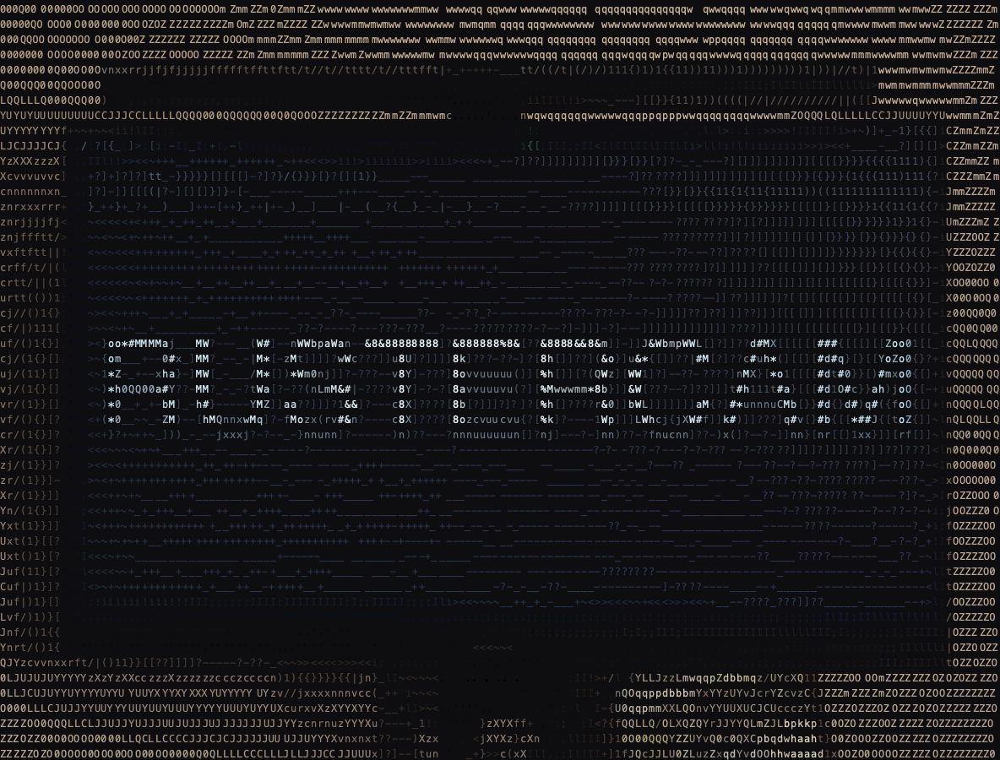

# rustercam



`rustercam` is a Rust port of [`terminalcam`](https://gitlab.com/here_forawhile/terminalcam), a real-time ASCII camera for the terminal by [`here_forawhile`](https://gitlab.com/here_forawhile).

It captures your webcam, converts each frame into colored ASCII art, and renders it directly in the terminal. It also supports interactive recording, playback, and screenshots.

## Features

- Live webcam to ASCII rendering in the terminal
- Truecolor, 256-color, 16-color, grayscale, green, and red display modes
- Interactive controls for contrast, brightness, rotation, invert, flip, presets, recording, and screenshots
- `.tcam` recording and playback, compatible with the v1/v2 format used by `terminalcam`
- SVG screenshot export, with the older HTML export kept available
- Native macOS/Linux webcam capture with `ffmpeg` fallback
- Runtime backend indicator and camera device cycling
- Termux capture using existing platform tools

## Status

This is an early Rust port. The core live preview, controls, screenshots, recording, and playback are implemented, but the Python original is still the reference implementation for feature completeness and behavior.

## Requirements

### macOS

- Rust toolchain
- Camera permission for your terminal app
- Optional: `ffmpeg` fallback if native capture fails

Install optional `ffmpeg` fallback with Homebrew:

```bash
brew install ffmpeg
```

### Linux

- Rust toolchain
- A V4L2 webcam, usually `/dev/video0`
- Optional: `ffmpeg` fallback if native capture fails

Example optional fallback install:

```bash
sudo apt install ffmpeg
```

### Termux

- Rust toolchain
- `ffmpeg`
- `termux-api`
- The Termux:API companion app with camera permission

```bash
pkg install ffmpeg termux-api rust
```

## Installation

Clone and build from source:

```bash
git clone git@github.com:hatute/rustercam.git
cd rustercam
cargo build --release
```

Run it:

```bash
cargo run --release
```

Or run the built binary:

```bash
./target/release/rustercam
```

Prebuilt release archives, when available, are attached to GitHub Releases. The current packaging script builds a macOS archive for the local machine:

```bash
scripts/package-release.sh v0.1.0
```

## Usage

```bash
# Basic live camera
cargo run --release

# Plain ASCII, no color
cargo run --release -- --no-color

# Lower resolution, useful for slower terminals
cargo run --release -- --resolution low

# Start with a specific camera device index
cargo run --release -- --camera 1

# Invert brightness for light terminal backgrounds
cargo run --release -- --invert

# Mirror the camera horizontally
cargo run --release -- --flip

# Record while viewing
cargo run --release -- --record recording/session.tcam

# Play a recording
cargo run --release -- --play recording/session.tcam
```

## Options

```text
--no-color                   Disable colored output
--resolution low|medium|high Camera capture resolution
--contrast <FLOAT>           Contrast multiplier
--brightness <INT>           Brightness offset
--ramp long|short            ASCII character ramp
--invert                     Invert brightness
--flip                       Mirror camera horizontally
--char-aspect <FLOAT>        Terminal character width/height ratio
--camera <N>                 Camera device index
--rotate 0|1|2|3             Rotate in 90 degree steps
--platform auto|macos|linux|termux
--record <FILE>              Record to a .tcam file while viewing
--play <FILE>                Play back a .tcam recording
```

## Controls

| Key | Action |
|---|---|
| `1` | Toggle invert |
| `2` | Rotate 0/90/180/270 |
| `f` | Toggle horizontal flip |
| `3` | Start/stop recording |
| `4` | Capture screenshot |
| `Shift-H` | Capture HTML screenshot |
| `5` | Cycle preset |
| `c` | Cycle camera device |
| `↑` / `↓` | Adjust contrast |
| `←` / `→` | Adjust brightness |
| `s` | Settings |
| `h` | Help |
| `q` | Quit |

The top status line shows the active capture backend, for example `nokhwa`,
`ffmpeg`, or `termux`. On macOS and Linux, `rustercam` tries the native
`nokhwa` backend first and only starts `ffmpeg` if native capture cannot be
opened. The camera status on the second line shows the current camera name and
its 1-based position among detected devices, such as `(1/2)`.

## Output Files

- SVG screenshots are saved under `capture/`
- HTML screenshots are also saved under `capture/`
- Default interactive recordings are saved under `recording/`
- Explicit `--record path/to/file.tcam` paths are used exactly as provided

## Recording Format

`rustercam` uses the `.tcam` recording format from `terminalcam`.

The current implementation can read v1/v2 recordings and writes v2-style recordings with keyframes, deltas, color quantization, optional derived characters, timestamp deltas, and zlib compression.

## Project Layout

The codebase is split by responsibility:

| Path | Purpose |
|---|---|
| `src/main.rs` | CLI entry point and live/playback dispatch |
| `src/app.rs` | Main application loop and interactive state |
| `src/capture.rs` | Native, `ffmpeg`, and Termux capture backends plus camera enumeration |
| `src/cli.rs` | Command-line arguments and shared option enums |
| `src/frame.rs` | Raw and rendered frame data structures |
| `src/render.rs` | Frame rotation/flip, ASCII rendering, and color conversion |
| `src/recording.rs` | `.tcam` encoder/decoder and recording presets |
| `src/export.rs` | HTML and SVG screenshot export helpers |
| `src/ui.rs` | Terminal guard, HUD, help, and settings overlays |
| `src/playback.rs` | `.tcam` playback loop |

## Acknowledgements

This project is based on [`terminalcam`](https://gitlab.com/here_forawhile/terminalcam), created by [`here_forawhile`](https://gitlab.com/here_forawhile).

The original project established the camera capture flow, terminal rendering behavior, controls, presets, screenshot ideas, and `.tcam` recording format that this Rust port follows.

## License

This project is released under the MIT License. See [LICENSE](LICENSE).

The original `terminalcam` project is also MIT licensed:

```text
Copyright (c) 2026 here_forawhile
```

The original attribution is retained in this README and in the license notice.
